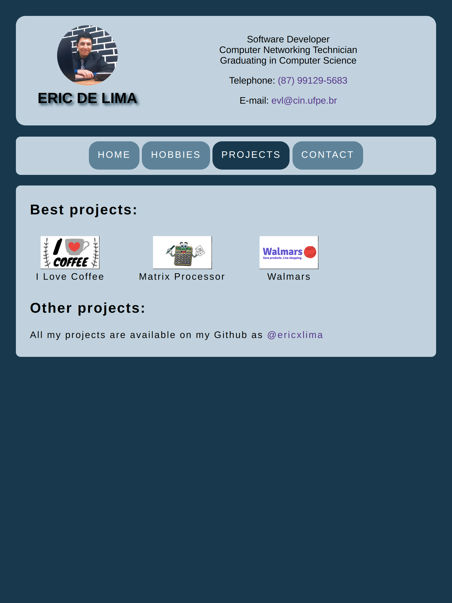
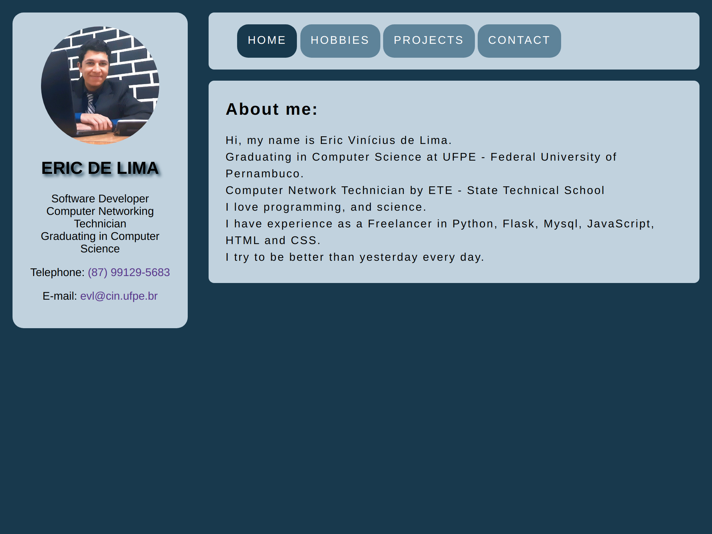

# web-challenge-IC
## A simple responsive web page developed __only in CSS and HTML__, for discipline of Introduction to Computing - IF668 at UFPE. 

## To see the complete project [__visit here__](https://www.cin.ufpe.br/~evl/)

### Small Devices

### Medium Devices

### Large Devices

